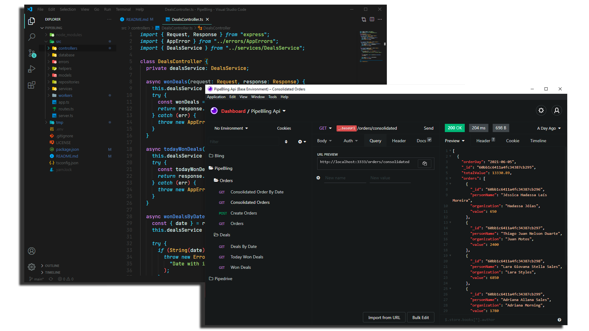

<h1 align="center">:+1: PipeBling Api :green_heart:</h1>

<p align="center">
  <a href="https://www.linkedin.com/in/igor-gregori/">
    
  </a>
  <a href="https://github.com/Igor-Gregori/PipeBling/blob/main/LICENSE">
    
  </a>
  <a href="https://github.com/Igor-Gregori/PipeBling/issues">
    
  </a>
  <a href="https://github.com/Igor-Gregori/PipeBling/issues?q=is%3Aissue+is%3Aclosed">
    
  </a>
  <a href="https://github.com/Igor-Gregori/PipeBling/stargazers">
    
  </a>
  <a href="https://github.com/Igor-Gregori/PipeBling">
    
  </a>
</p>

<p align="center">
  <a href="#page_facing_up-descrição">Descrição</a>&nbsp;&nbsp;&nbsp;|&nbsp;&nbsp;&nbsp;
  <a href="#-tecnologias">Tecnologias</a>&nbsp;&nbsp;&nbsp;|&nbsp;&nbsp;&nbsp;
  <a href="#-diagrama">Diagrama</a>&nbsp;&nbsp;&nbsp;|&nbsp;&nbsp;&nbsp;
  <a href="#computer-instalação">Instalação</a>&nbsp;&nbsp;&nbsp;|&nbsp;&nbsp;&nbsp;
  <a href="#man-Desenvolvedor">Desenvolvedor</a>&nbsp;&nbsp;&nbsp;|&nbsp;&nbsp;&nbsp;
  <a href="#-licença">Licença</a>
</p>

<p align="center">
    
</p>

## :page_facing_up: Descrição

Essa api tem o intuito de fazer uma integração simples entre o [CRM Pipedrive](https://www.pipedrive.com/pt) e o [ERP Bling](https://www.bling.com.br/home), registrando os Deals com status ganho ("won") do [Pipedrive](https://www.pipedrive.com/pt) como pedido de vendas no [Bling](https://www.bling.com.br/home) e também fazendo a consolidação dos dados das vendas em um banco orientado a documentos [MongoDB](https://www.mongodb.com/)

## ✨ Tecnologias

Esse projeto foi desenvolvido com as seguintes tecnologias:

- [TypeScript](https://www.typescriptlang.org/)
- [Express](https://expressjs.com/pt-br/)
- [Moment Timezone](https://momentjs.com/timezone/docs/)
- [Mongoose](https://mongoosejs.com/)
- [Node Schedule](https://www.npmjs.com/package/node-schedule)
- Para mais detalhes, veja o <kbd>[package.json](./package.json)</kbd>

## 🔶 Diagrama


## :computer: Instalação

### Pré-requisitos

Antes de começar, você vai precisar ter instalado em sua máquina as seguintes ferramentas:
[Git](https://git-scm.com), [Node.js](https://nodejs.org/en/), Além disto é bom ter um editor para trabalhar com o código como [VSCode](https://code.visualstudio.com/)

```bash
# Clone este repositório.
$ git clone https://github.com/Igor-Gregori/PipeBling

# Vá para a pasta Net-Promoter-Score-NLW
$ cd PipeBling

# Instale as dependências
$ yarn

# Execute aplicação
$ yarn dev

# O app vai está rodando na porta 3333
```
Agora através de algum client rest api como o [Insomnia](https://insomnia.rest/download) você poderá trabalhar com a api


## :man: Desenvolvedor

<a href="https://github.com/Igor-Gregori">
 
  <br />
 <sub><b>Igor Gregori</b></sub>
</a>

Desenvolvido por <b>Igor Gregori</b> :metal::satisfied::+1: Entre em contato! :speech_balloon:

<a href="https://www.linkedin.com/in/igor-gregori/">
  
</a>

## :closed_book: Licença

This project is [MIT](https://github.com/Igor-Gregori/moveit/blob/main/LICENSE) licensed.