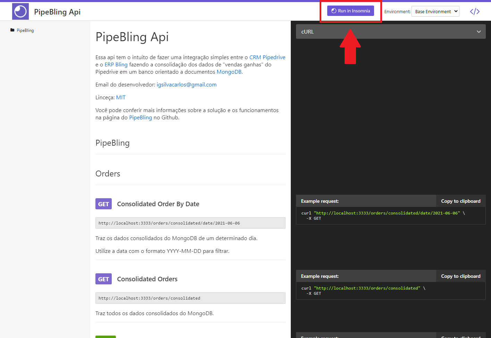

<h1 align="center">:computer: PipeBling Api :green_heart:</h1>

<p align="center">
  <a href="https://www.linkedin.com/in/igor-gregori/">
    
  </a>
  <a href="https://github.com/Igor-Gregori/PipeBling/blob/main/LICENSE">
    
  </a>
  <a href="https://github.com/Igor-Gregori/PipeBling/issues">
    
  </a>
  <a href="https://github.com/Igor-Gregori/PipeBling/issues?q=is%3Aissue+is%3Aclosed">
    
  </a>
  <a href="https://github.com/Igor-Gregori/PipeBling/stargazers">
    
  </a>
  <a href="https://github.com/Igor-Gregori/PipeBling">
    
  </a>
</p>

<p align="center">
  <a href="#page_facing_up-descrição">Descrição</a>&nbsp;&nbsp;&nbsp;|&nbsp;&nbsp;&nbsp;
  <a href="#thought_balloon-solucao">Solução</a>&nbsp;&nbsp;&nbsp;|&nbsp;&nbsp;&nbsp;
  <a href="#sparkles-tecnologias">Tecnologias</a>&nbsp;&nbsp;&nbsp;|&nbsp;&nbsp;&nbsp;
  <a href="#email-contas">Contas de teste</a>&nbsp;&nbsp;&nbsp;|&nbsp;&nbsp;&nbsp;
  <a href="#large_orange_diamond-diagrama">Diagrama</a>&nbsp;&nbsp;&nbsp;|&nbsp;&nbsp;&nbsp;
  <a href="#recycle-rotina">Rotina</a>&nbsp;&nbsp;&nbsp;|&nbsp;&nbsp;&nbsp;
  <a href="#book-documentacao">Documentação</a>&nbsp;&nbsp;&nbsp;|&nbsp;&nbsp;&nbsp;
  <a href="#computer-instalação">Instalação</a>&nbsp;&nbsp;&nbsp;|&nbsp;&nbsp;&nbsp;
  <a href="#man-Desenvolvedor">Desenvolvedor</a>&nbsp;&nbsp;&nbsp;|&nbsp;&nbsp;&nbsp;
  <a href="#closed_book-licença">Licença</a>
</p>

<p align="center">
    
</p>

## :page_facing_up: Descrição

Essa api tem o intuito de fazer uma integração simples entre o [CRM Pipedrive](https://www.pipedrive.com/pt) e o [ERP Bling](https://www.bling.com.br/home), registrando os Deals com status ganho ("won") do Pipedrive como pedido de vendas no Bling e também fazendo a consolidação dos dados das vendas em um banco orientado a documentos [MongoDB](https://www.mongodb.com/).


## :thought_balloon: Solução
Imagine que você venda algum tipo de serviço e gosta de usar o Pipedrive para gerenciar os seus négocios/vendas.

Porém precisa emitir nota e ter alguns documentos que o sistema Bling oferece a você.

O PipeBling realiza a integração dessas duas plataformas além de fazer uma consolidação de todas as vendas por dia em um banco separado.

Você pode deixar o trabalho rodando automáticamente sem se preocupar em executar nada, basta configurar uma rotina de processos.


## :sparkles: Tecnologias

Esse projeto foi desenvolvido com as seguintes tecnologias:

- [TypeScript](https://www.typescriptlang.org/)
- [Express](https://expressjs.com/pt-br/)
- [Moment Timezone](https://momentjs.com/timezone/docs/)
- [Mongoose](https://mongoosejs.com/)
- [Node Schedule](https://www.npmjs.com/package/node-schedule)
- Para mais detalhes, veja o <kbd>[package.json](./package.json)</kbd>


## :email: Contas de Teste
Todas as contas foram criadas usando um [Email Temporário](https://temp-mail.org/pt/) e são válidas até 20/06/2021

Conta Pipedrive:

	usuário: igorshop2
	email:   xirixor512@pidhoes.com
	senha:   123xx123


Conta Bling:

	usuário: igorshop2
	email:   xirixor512@pidhoes.com
	senha:   123xx123

Conta MongoDB Atlas:

	usuário: igorshop2
	email:   xirixor512@pidhoes.com
	senha:   123xx123
  

Para mais informações acesse [.env](./.env)

Você também pode usar as suas credencias, não se esqueça de substiuir todas as apiKeys necessárias.


## :large_orange_diamond: Diagrama
O fluxo de consolidação de dados do PipeBling funciona dando início a uma requisição dos deals com status won (negócios fechados/ganhos) para o Pipedrive. O Pipebling filtra os deals e monta uma estrura que terá somente os deals com status won do dia atual e depois organiza e insere os como pedidos de venda no Bling e consolida os dados com a soma de todas as ordens no MongoDB, segue um diagrama exemplificando o processo:


## :recycle: Rotina
O PipeBling conta com um Mini Worker para automatizar a tarefa de consolidar os dados, utilizando a tecnologia [Node Schedule](https://www.npmjs.com/package/node-schedule), podemos definir uma rotina de processos a ser realizada na aplicação. O PipeBling já tem uma rotina padrão definida para consolidar os dados todo dia ás 23:00.

Você pode ativar/desativar a rotina alterando a variável de ambiente "WORKER_ACTIVE".

Fique atento com a configuraçao de BASE_URL e WORK_IN_HOUR caso tenha problemas ao trabalhar com a rotina.

Não se preocupe com a chamada da rotina mais de uma vez, é verificado se a consolidação já foi realizada.


## :book: Documentação
Você pode conferir mais sobre os endpoints nessa simples e rápida documentação

- [PipeBling Api Documentation](https://ecstatic-einstein-0d6a85.netlify.app/)

Você também pode importar as chamadas dos endpoints clicando no botão "Run in Insomnia".




## :computer: Instalação

### Pré-requisitos

Antes de começar, você vai precisar ter instalado em sua máquina as seguintes ferramentas:
[Git](https://git-scm.com), [Node.js](https://nodejs.org/en/).
Além disto é bom ter um editor para trabalhar com o código como [VSCode](https://code.visualstudio.com/)

```bash
# Clone este repositório.
$ git clone https://github.com/Igor-Gregori/PipeBling

# Vá para a pasta Net-Promoter-Score-NLW
$ cd PipeBling

# Instale as dependências
$ yarn

# Execute aplicação
$ yarn dev

# O app vai está rodando na porta 3333
# Você pode alterar ou conferir a porta acessando o arquivo .env
```
Agora através de algum client rest api como o [Insomnia](https://insomnia.rest/download) ou o [Postman](https://www.postman.com/) você poderá trabalhar com a api.


## :man: Desenvolvedor

<a href="https://github.com/Igor-Gregori">
 
  <br />
 <sub><b>Igor Gregori</b></sub>
</a>

Desenvolvido por <b>Igor Gregori</b> :metal::satisfied::+1: Entre em contato! :speech_balloon:

<a href="https://www.linkedin.com/in/igor-gregori/">
  
</a>

## :closed_book: Licença

This project is [MIT](https://github.com/Igor-Gregori/moveit/blob/main/LICENSE) licensed.